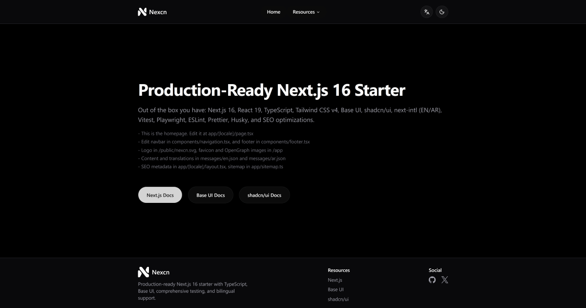

# Nexcn



A Next.js 16 starter with everything you need to ship fast: TypeScript, Tailwind CSS v4, Base UI, internationalization, and testing configured out of the box.

## About Nexcn

Nexcn is designed for developers who want to build modern web applications without spending time on boilerplate configuration. Whether you're building a personal project, SaaS product, or multi-language application, Nexcn comes pre-configured with production-ready tooling and best practices so you can focus on building your product.

## Prerequisites

Before getting started, make sure you have:

- **Node.js** 20.x or higher
- **pnpm** 8.x or higher (install with `npm install -g pnpm`)

## Quick Start

```bash
# 1. Install dependencies
pnpm install

# 2. Run development server
pnpm dev
```

Open [http://localhost:3000](http://localhost:3000) in your browser.

## What's Included

- **Next.js 16** with App Router and React 19 - Server components for better performance and modern development patterns
- **TypeScript** with strict mode enabled - Catch errors at compile time and write safer, more maintainable code
- **Tailwind CSS v4** with Base UI components - Build responsive UIs with utility-first styling and accessible components
- **shadcn/ui** integration - Copy-paste component library built on Radix UI for maximum customization
- **next-intl** for English/Arabic i18n - Internationalization with RTL support for global applications
- **Vitest** for unit testing + **Playwright** for E2E tests - Testing setup so you can ship with confidence
- **ESLint**, **Prettier**, and **Husky** for code quality - Automated formatting and pre-commit hooks maintain code standards
- **SEO optimized** - Metadata management and automatic sitemap generation for search visibility

## Documentation

Read the guides in order to get started:

1. **[Getting Started](./Docs/01-getting-started.md)** - Prerequisites, environment setup, and initial configuration
2. **[Project Structure](./Docs/02-project-structure.md)** - Folder organization and where to add your code
3. **[Styling Guide](./Docs/03-styling-guide.md)** - Using Tailwind CSS v4 and customizing components
4. **[Adding Components](./Docs/04-adding-components.md)** - Creating reusable components with Base UI and shadcn/ui
5. **[Internationalization](./Docs/05-internationalization-guide.md)** - Setting up multi-language support with next-intl
6. **[Testing Guide](./Docs/06-testing-guide.md)** - Writing unit and E2E tests with Vitest and Playwright
7. **[Cheat Sheet](./Docs/07-cheat-sheet.md)** - Quick reference for common tasks and commands

## Commands

Development

```bash
pnpm dev # Start dev server
pnpm build # Build for production
pnpm start # Run production build
```

Testing

```bash
pnpm test # Run unit tests
pnpm test:e2e # Run E2E tests
pnpm test:coverage # Generate coverage report
```

Code Quality

```bash
pnpm lint # Check for linting errors
pnpm lint:fix # Auto-fix linting errors
pnpm format # Format code with Prettier
pnpm type-check # Check TypeScript types
```

## Deployment

To deploy a production build:

```bash
pnpm build
pnpm start
```

## Troubleshooting

**"pnpm command not found"**

- Install pnpm globally: `npm install -g pnpm`
- Or use npx: `npx pnpm install`

**Port 3000 already in use**

- Run dev server on a different port: `pnpm dev -- -p 3001`

**Styling not applying correctly**

- Clear `.next` cache: `rm -rf .next` (or `rmdir /s .next` on Windows)
- Restart the development server

**TypeScript errors in IDE**

- Make sure TypeScript is installed: `npm install -g typescript`
- Restart your editor's TypeScript server

## Contributing

Fork the repository, create a feature branch, and submit a pull request. Licensed under MIT.
