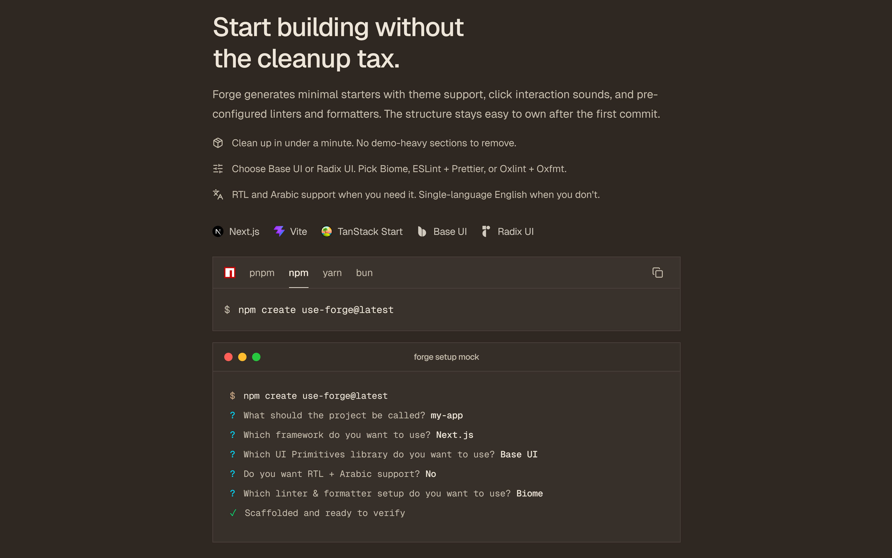

# Forge

Forge is a CLI that creates clean React starters so you can begin building right away.

It uses shadcn for scaffolding, then applies Forge layers for app shell setup, theme support, optional RTL routing, sound hooks, fallback pages, metadata, code-quality setup, and starter docs.

Website: [use-forge.vercel.app](https://use-forge.vercel.app/)

## Quick Start

Use one of these commands:

```bash
npm create use-forge@latest
pnpm create use-forge
bun create use-forge
yarn create use-forge
```

You can also run the CLI directly after install:

```bash
forge generate
```

## What You Get

Forge starters are intentionally small and easy to edit.

Each app includes:

- a minimal starter page
- a theme switch
- a language switch only when RTL is enabled
- framework-native error and not-found pages
- favicon and core metadata
- sound hooks for clicks and theme switching
- lint and format setup based on your chosen option
- a README that matches your package manager

Each app does not include internal Forge specs, skills, or planning docs.

## Choose Your Setup

Frameworks:

- `next` (Next.js)
- `vite` (Vite)
- `start` (TanStack Start)

UI base:

- `base` (Base UI)
- `radix` (Radix UI)

Direction:

- `--ltr` for English only
- `--rtl` for English and Arabic with locale routes

Package manager:

- `pnpm`
- `npm`
- `yarn`
- `bun`

Code quality:

- `biome`
- `eslint-prettier`
- `oxlint-oxfmt`

Current default preset:

```txt
next + base + ltr + pnpm + biome
```

## Common Commands

Interactive generation:

```bash
forge generate
```

Preview plan only:

```bash
forge plan
```

Generate from flags:

```bash
forge generate --name my-app --framework next --base base --ltr --package-manager pnpm --code-quality biome
```

Generate in current empty folder:

```bash
forge generate --name .
```

Generate a retained fixture in `fixtures/`:

```bash
forge generate --fixture --name next-base-ltr --framework next --base base --ltr
```

## Naming Rules

Project names must use lowercase letters, numbers, and single hyphens.

Valid examples:

```txt
my-app
forge-demo
app2
```

Invalid examples:

```txt
MyApp
my_app
my--app
my app
con
```

The special name `.` is valid when you generate into the current empty folder.

## Current Status

Forge is in its first public release pass.

The npm package name is `create-use-forge`, and it exposes:

- `forge`
- `create-use-forge`

The marketing site is deployed from `marketing-site/` on Vercel. npm publish is the remaining public release step.

## How Forge is Built

Forge is a single-package TypeScript CLI with three layers:

1. Scaffold adapter
2. Framework overlay
3. Feature packs

In short, scaffold tools create the base app, overlays apply framework shell details, and feature packs add cross-cutting pieces like docs, sounds, metadata, dependency freshness, and code quality.

## Repository Map

```txt
src/                  CLI, generator, overlays, feature packs, verification
assets/branding/      Forge assets copied into generated apps
fixtures/             generated regression fixtures
marketing-site/       Next.js marketing site
spec/                 project contracts and working memory
deprecated/           legacy code outside active surface
```

## Development

Install dependencies:

```bash
pnpm install
```

Run CLI from source:

```bash
pnpm dev -- --help
pnpm dev -- plan
pnpm dev -- generate --dry-run
```

Build:

```bash
pnpm build
```

Typecheck:

```bash
pnpm typecheck
```

Test:

```bash
pnpm test
```

Inspect package contents:

```bash
npm pack --dry-run
```

## Marketing Site

Local checks:

```bash
pnpm --dir marketing-site typecheck
pnpm --dir marketing-site lint
pnpm --dir marketing-site build
```

Vercel settings:

```txt
Root Directory: marketing-site
Framework Preset: Next.js
Install Command: default
Build Command: default
Output Directory: default
```

## Release

Release checklist: [spec/release-and-publishing.md](./spec/release-and-publishing.md)

Before npm publish:

```bash
pnpm install --frozen-lockfile
pnpm typecheck
pnpm test
pnpm build
npm pack --dry-run
```

For local tarball smoke tests, use `npm exec --package <tarball>` instead of `npm create <tarball>`.

## License

MIT. See [LICENSE](./LICENSE).
